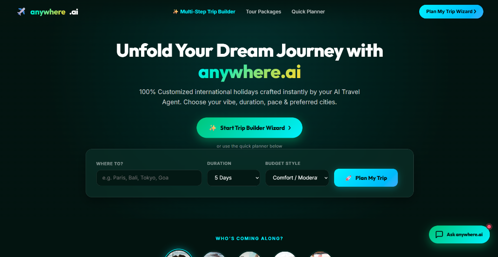
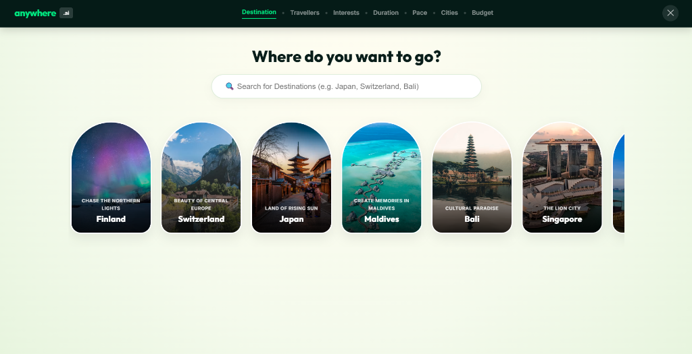
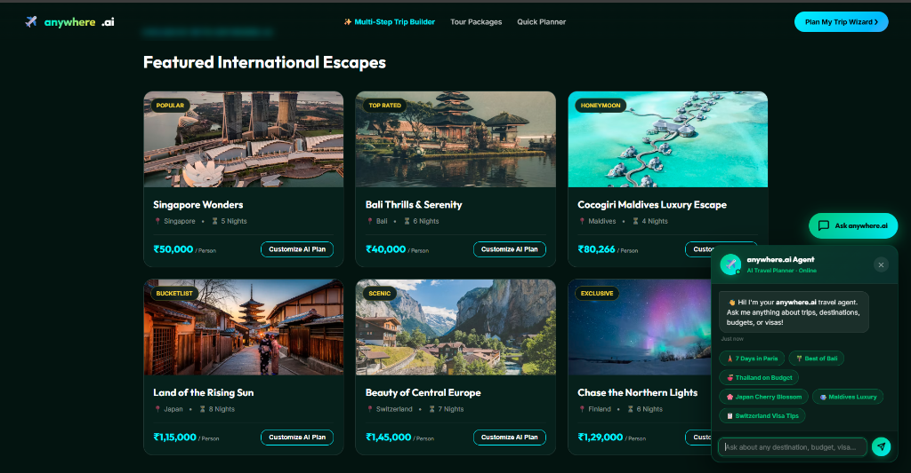
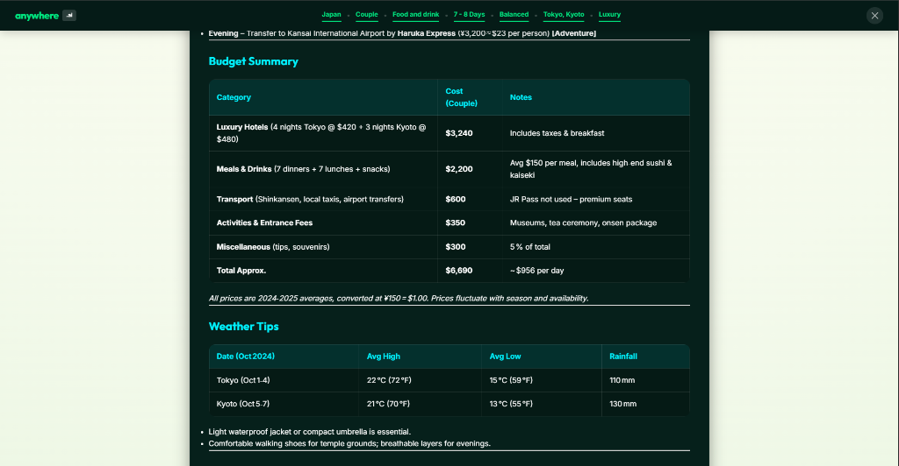
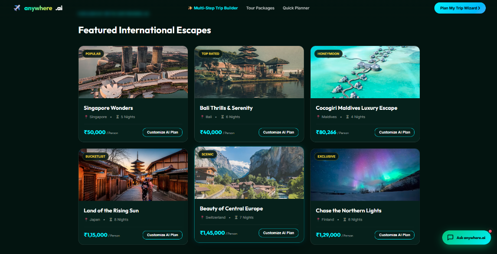

# anywhere.ai - AI Travel Agent & Itinerary Planner 🌍✈️

**anywhere.ai** is an intelligent, full-stack travel planning application powered by LangGraph, LangChain, and Groq. It acts as your personal AI Travel Agent, generating highly detailed, structured, day-by-day travel itineraries, complete with budget breakdowns, weather forecasts, and dynamic visual layouts.

## ✨ Features

- **Multi-Step Trip Builder Wizard:** An interactive, beautifully designed UI to capture your travel preferences (destination, duration, pace, budget, persona, and travel vibes).
- **Dual Itineraries:** The AI generates both "Highlights" (must-see spots) and "Hidden Gems" (off-the-beaten-path) options for your destination.
- **Floating AI Chatbot:** A responsive chat widget built directly into the site, allowing free-form queries about destinations, visas, or specific travel advice.
- **Structured Day-by-Day Layout:** Generates a visually stunning itinerary layout grouping activities by day and city, complete with time-tags, category badges (Food, Culture, Adventure), and transit connectors.
- **Real-time Data Integration:** Uses OpenWeather and Tavily (via LangChain tools) to fetch live attraction details and weather forecasts.
- **Export & Download:** Save your AI-generated travel plans directly as Markdown files.
- **Premium Design:** Features a modern, glassmorphic UI with smooth animations, dynamic suggestion chips, and responsive breakpoints.

## 📸 Screenshots

### The anywhere.ai Interface


### Multi-Step Trip Builder Wizard


### Floating AI Chatbot


### AI-Generated Itinerary & Budget


### Featured International Escapes


## 🛠️ Tech Stack

**Backend:**
- **Python 3**
- **FastAPI** & **Uvicorn** for high-performance API routing.
- **LangChain** & **LangGraph** for AI agent orchestration and tool execution.
- **Groq API** for lightning-fast LLM inference (supports multiple models).

**Frontend:**
- **HTML5**, **CSS3**, **Vanilla JavaScript** (No heavy frontend frameworks required).
- **Jinja2 Templates** for server-side rendering.
- **Marked.js** for client-side Markdown to HTML conversion.

## 🚀 Getting Started

### Prerequisites
- Python 3.9+
- API Keys for:
  - **Groq** (Required for LLM)
  - **OpenWeatherMap** (Optional, for live weather)
  - **Tavily** (Optional, for live search)
  - **Google Places API** (Optional, for places data)

### Installation

1. **Clone the repository:**
   ```bash
   git clone https://github.com/yourusername/anywhere-ai-travel-planner.git
   cd anywhere-ai-travel-planner
   ```

2. **Set up a virtual environment:**
   ```bash
   python -m venv venv
   # Windows:
   .\venv\Scripts\activate
   # macOS/Linux:
   source venv/bin/activate
   ```

3. **Install dependencies:**
   ```bash
   pip install -r requirements.txt
   ```

4. **Configure Environment Variables:**
   Create a `.env` file in the root directory and add your API keys:
   ```env
   GROQ_API_KEY=your_groq_api_key_here
   OPENWEATHER_API_KEY=your_openweather_api_key_here  # Optional
   TAVILY_API_KEY=your_tavily_api_key_here            # Optional
   GOOGLE_MAPS_API_KEY=your_google_maps_api_key_here  # Optional
   ```

### Running the Application

Start the FastAPI server using Uvicorn:

```bash
python -m uvicorn app:app --host 127.0.0.1 --port 8080 --reload
```

Then, open your browser and navigate to: **http://127.0.0.1:8080**

## 📂 Project Structure

```text
├── app.py                  # FastAPI application entry point and routes
├── main.py                 # CLI interface for the travel planner
├── constants.py            # AI agent system prompts and constants
├── requirements.txt        # Python dependencies
├── .env                    # Environment variables (API keys)
├── output/                 # Directory where generated markdown itineraries are saved
├── static/                 # Frontend assets
│   ├── css/
│   │   ├── style.css       # Main stylesheet
│   │   ├── wizard.css      # Wizard-specific styles
│   │   └── chat.css        # Floating chatbot styles
│   └── js/
│       ├── app.js          # Main frontend logic and itinerary renderer
│       ├── wizard.js       # Multi-step form logic
│       └── chat.js         # Chatbot interaction logic
├── templates/              # HTML templates
│   ├── index.html          # Landing page and main application container
│   └── builder.html        # Multi-step wizard page
└── src/                    # Core application logic
    ├── agent/              # LangGraph workflow definitions
    ├── tools/              # LangChain tools (weather, places, expenses)
    └── utils/              # Helper functions and configuration loaders
```

## 📜 License

This project is open-source and available under the [MIT License](LICENSE).
